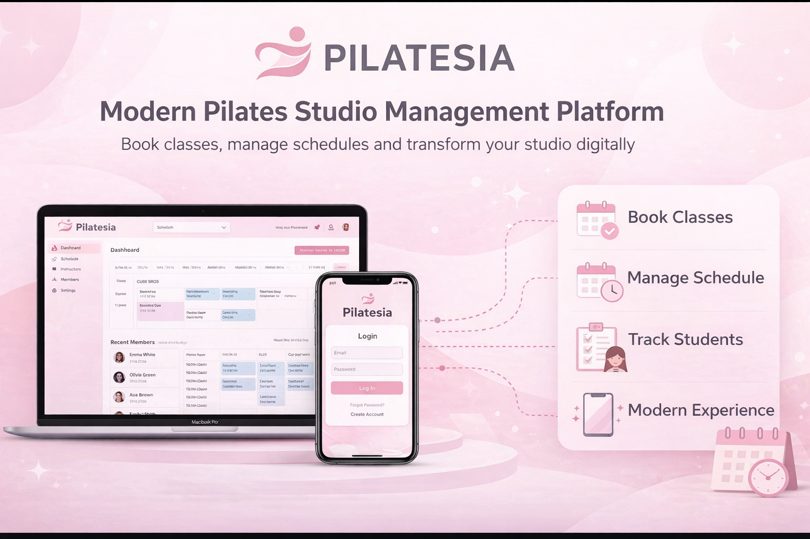

# Pilatesia

---

## Proje Hakkında

### Proje Tanımı: 

Pilatesia, pilates eğitmenleri ve öğrenciler için geliştirilmiş modern bir ders planlama ve rezervasyon uygulamasıdır. Kullanıcılar mevcut pilates derslerini görüntüleyebilir, derslere kayıt olabilir ve kendi ders programlarını kolayca yönetebilirler. Eğitmenler ise yeni dersler oluşturabilir, katılımcıları takip edebilir ve ders planlarını organize edebilir.

### Proje Kategorisi:
Sağlık ve Fitness / Rezervasyon ve Planlama Sistemi

---

## Proje Linkleri

- **REST API Adresi:** https://pilatesia-api.onrender.com
- **Web Frontend Adresi:** https://pilatesia-web.vercel.app

---

## Proje Ekibi

**Grup Adı:** 
Savage-Pilatesia

**Ekip Üyeleri:** 
- Talha Pakdil
- Büşra Mangaoğlu

---

## Dokümantasyon

Proje dokümantasyonuna aşağıdaki linklerden erişebilirsiniz:

1. [Gereksinim Analizi](Gereksinim-Analizi.md)
2. [REST API Tasarımı](API-Tasarimi.md)
3. [REST API](Rest-API.md)
4. [Web Front-End](WebFrontEnd.md)
5. [Mobil Front-End](MobilFrontEnd.md)
6. [Mobil Backend](MobilBackEnd.md)
7. [Video Sunum](Sunum.md)
